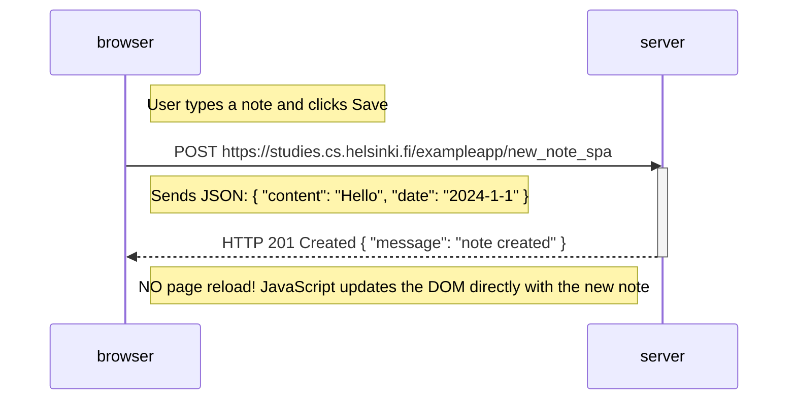

# spa-new-note.md

```mermaid
sequenceDiagram
    participant browser
    participant server

    Note right of browser: User types a note and clicks Save

    browser->>server: POST https://studies.cs.helsinki.fi/exampleapp/new_note_spa
    activate server
    Note right of browser: Sends JSON: { "content": "Hello", "date": "2024-1-1" }
    server-->>browser: HTTP 201 Created { "message": "note created" }
    deactivate server

    Note right of browser: NO page reload! JavaScript updates the DOM directly with the new note

```
